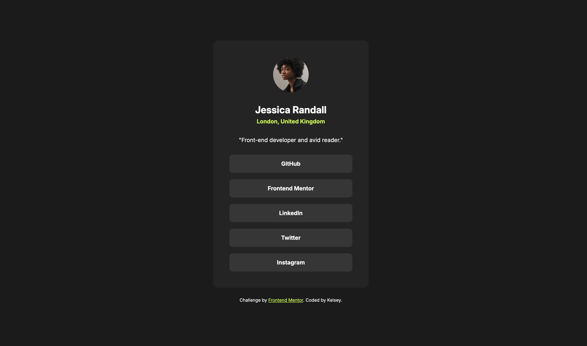

# Frontend Mentor - Social links profile solution

This is a solution to the [Social links profile challenge on Frontend Mentor](https://www.frontendmentor.io/challenges/social-links-profile-UG32l9m6dQ). Frontend Mentor challenges help you improve your coding skills by building realistic projects. 

## Table of contents

- [Overview](#overview)
  - [The challenge](#the-challenge)
  - [Screenshot](#screenshot)
  - [Links](#links)
- [My process](#my-process)
  - [Built with](#built-with)
  - [What I learned](#what-i-learned)
  - [Continued development](#continued-development)

**Note: Delete this note and update the table of contents based on what sections you keep.**

## Overview

### The challenge

The task was to create a social links profile page where users are able to:

- See hover and focus states for all interactive elements on the page

### Screenshot

### Links

- Solution URL: [Solution](https://github.com/kelseyjhayes/Social-Links-Profile)
- Live Site URL: [Live site] (https://your-live-site-url.com)

## My process

### Built with

- Semantic HTML5 markup
- CSS
- Flexbox
- Mobile-first workflow

### What I learned

The initial development of this design was relatively straightforward. It was good to be able to practice media queries, using a mobile first workflow. 

### Continued development

Something I'd like to continue working on is my understanding of responsive positioning, particularly for smaller sized screens. I'm able position elements on desktop screens well, but I run into issues when the screen size is smaller than the size of the element (e.g. if the length of a phone is smaller than the length of a container element).